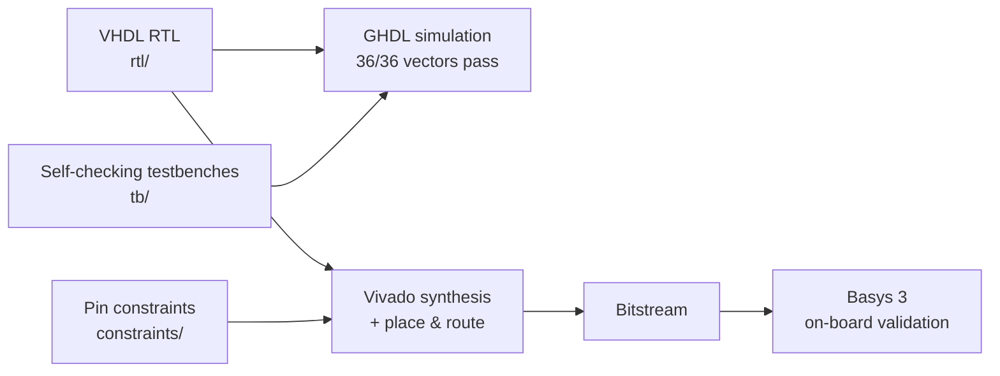

# Combinational Decoders on the Basys 3 FPGA


-e4572e)


Two combinational decoder designs in VHDL, exhaustively verified in simulation and
validated on real hardware (Digilent Basys 3, Artix-7 `xc7a35tcpg236-1`):

| Module | Function | Outputs | Enable |
|---|---|---|---|
| [`decoder_2to4`](rtl/decoder_2to4.vhd) | 2-to-4 binary decoder | Active-low (one-cold) | — |
| [`decoder_bcd`](rtl/decoder_bcd.vhd) | BCD-to-decimal (4-to-10) decoder | Active-high (one-hot) | Active-high, with invalid-code rejection |

The project covers the full path from Boolean derivation to working silicon:
truth tables → minimized equations → synthesizable RTL → exhaustive self-checking
simulation → synthesis, place & route → on-board bring-up.

## Design flow



## Hardware view


The BCD decoder maps slide switches `SW0–SW3` to the BCD digit, `SW4` to the
enable, and drives LEDs `LD0–LD9` one-hot. Invalid codes (10–15) are rejected —
all LEDs stay off rather than aliasing onto a valid digit. The 2-to-4 decoder
uses `SW0–SW1` and `LD0–LD3`; its gate-level structure is drawn in
[docs/architecture.md](docs/architecture.md).

## Quick start

**Simulate** (requires [GHDL](https://ghdl.github.io/ghdl/)):

```sh
./scripts/run_tests.sh            # run all self-checking testbenches
WAVES=1 ./scripts/run_tests.sh    # also dump .ghw waveforms to build/sim/
```

**Build a bitstream** (requires AMD/Xilinx Vivado):

```sh
vivado -mode batch -source scripts/build_bitstream.tcl -tclargs decoder_2to4
vivado -mode batch -source scripts/build_bitstream.tcl -tclargs decoder_bcd
```

**Program the board**: open Vivado Hardware Manager, connect to the Basys 3 over
USB-JTAG, and program `build/vivado/<top>.bit`.

## Verification

Both designs are verified at two levels — full detail in
[docs/verification.md](docs/verification.md):

- **Simulation** — self-checking testbenches drive the *entire* input space
  (4 vectors for `decoder_2to4`, 32 for `decoder_bcd`, including disabled and
  invalid-code cases) and compare every output against a behavioral model.
  All 36 vectors pass under GHDL; CI re-runs them on every push.
- **Hardware** — each design was synthesized, placed & routed with Vivado and
  programmed onto a Basys 3. Observed LED behavior matched the truth tables
  for every tested input combination.

## Repository layout

```
.
├── rtl/                        # Synthesizable VHDL (one file per design)
├── tb/                         # Exhaustive self-checking testbenches
├── constraints/                # Basys 3 pin constraints (one XDC per top level)
├── scripts/
│   ├── run_tests.sh            # GHDL: analyze + run all testbenches
│   └── build_bitstream.tcl     # Vivado non-project batch flow (RTL -> .bit)
├── docs/
│   ├── architecture.md         # Theory of operation, truth tables, schematics
│   ├── verification.md         # Simulation and on-board test results
│   └── diagrams/               # SVG schematics
└── .github/workflows/sim.yml   # CI: run all testbenches on every push
```

## Documentation

- [Architecture](docs/architecture.md) — theory of operation, truth tables,
  Boolean derivations, and gate-level schematics
- [Verification](docs/verification.md) — testbench strategy, simulation
  results, and hardware validation

## License

[MIT](LICENSE)
