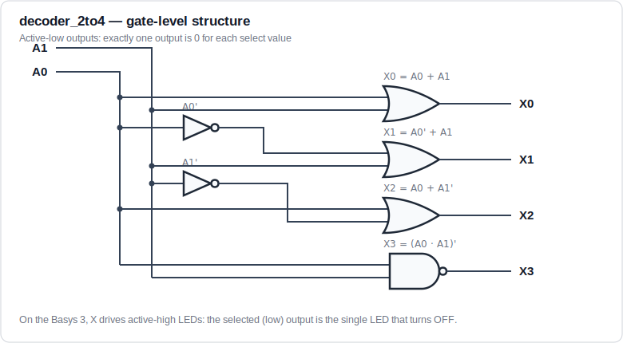
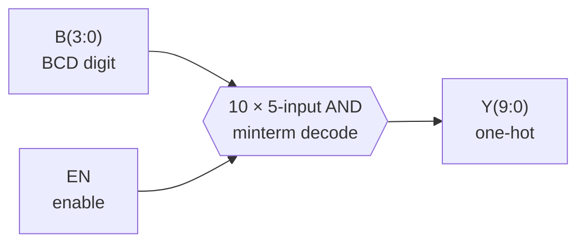
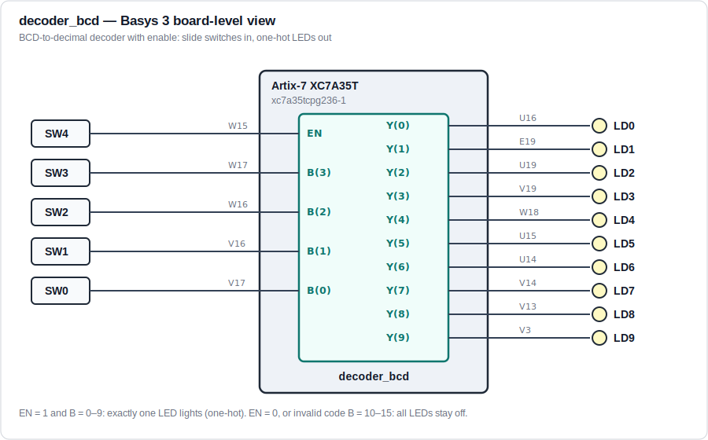

# Architecture

Both designs are pure combinational logic: no clock, no state. Each output is a
single Boolean function of the inputs, written directly as concurrent signal
assignments so the RTL reads one-to-one against the derived equations.

## `decoder_2to4` — 2-to-4 binary decoder, active-low outputs

A binary decoder asserts exactly one of its 2ⁿ outputs for each value of an
n-bit select input. This decoder is **active-low**: the selected output goes to
`0` while the other three stay at `1` (one-cold encoding), matching the
behavior of classic decoder parts such as the 74x139.

### Truth table

| A1 | A0 | X3 | X2 | X1 | X0 |
|:--:|:--:|:--:|:--:|:--:|:--:|
| 0 | 0 | 1 | 1 | 1 | **0** |
| 0 | 1 | 1 | 1 | **0** | 1 |
| 1 | 0 | 1 | **0** | 1 | 1 |
| 1 | 1 | **0** | 1 | 1 | 1 |

### Boolean equations

Each active-low output is the complement of one minterm of `A`. Applying
De Morgan's theorem gives the OR-form implemented in the RTL:

```
X0 = (A1'·A0')' = A0 + A1
X1 = (A1'·A0)'  = A0' + A1
X2 = (A1·A0')'  = A0 + A1'
X3 = (A1·A0)'
```

### Gate-level structure



### Interface and pin map (Basys 3)

| Port | Direction | Width | Board control | FPGA pin |
|---|---|---|---|---|
| `A[0]` | in | 1 | SW0 | V17 |
| `A[1]` | in | 1 | SW1 | V16 |
| `X[0]` | out | 1 | LD0 | U16 |
| `X[1]` | out | 1 | LD1 | E19 |
| `X[2]` | out | 1 | LD2 | U19 |
| `X[3]` | out | 1 | LD3 | V19 |

The Basys 3 LEDs are **active-high**, so the selected active-low output appears
on the board as the single LED that is *off* — a deliberate demonstration of
output polarity versus indicator polarity.

## `decoder_bcd` — BCD-to-decimal decoder, active-high outputs with enable

A 4-to-10 decoder that converts a BCD digit to a one-hot decimal output,
gated by an active-high enable — functionally the active-high counterpart of
the classic 7442 BCD decoder, extended with an enable input.



### Behavior

| Condition | Output |
|---|---|
| `EN = 1`, `B` = 0–9 (valid BCD) | Exactly one output high: `Y(B) = 1` |
| `EN = 1`, `B` = 10–15 (invalid code) | All outputs low |
| `EN = 0`, any `B` | All outputs low |

### Truth table (EN = 1)

| B3 | B2 | B1 | B0 | Decimal | Active output |
|:--:|:--:|:--:|:--:|:--:|:--:|
| 0 | 0 | 0 | 0 | 0 | Y0 |
| 0 | 0 | 0 | 1 | 1 | Y1 |
| 0 | 0 | 1 | 0 | 2 | Y2 |
| 0 | 0 | 1 | 1 | 3 | Y3 |
| 0 | 1 | 0 | 0 | 4 | Y4 |
| 0 | 1 | 0 | 1 | 5 | Y5 |
| 0 | 1 | 1 | 0 | 6 | Y6 |
| 0 | 1 | 1 | 1 | 7 | Y7 |
| 1 | 0 | 0 | 0 | 8 | Y8 |
| 1 | 0 | 0 | 1 | 9 | Y9 |
| 1 | 0 | 1 | 0 | 10 | none (invalid) |
| ⋮ | ⋮ | ⋮ | ⋮ | 11–15 | none (invalid) |

### Boolean equations

One product term per decimal output — the enable is ANDed into every minterm:

```
Y0 = EN·B3'·B2'·B1'·B0'        Y5 = EN·B3'·B2·B1'·B0
Y1 = EN·B3'·B2'·B1'·B0         Y6 = EN·B3'·B2·B1·B0'
Y2 = EN·B3'·B2'·B1·B0'         Y7 = EN·B3'·B2·B1·B0
Y3 = EN·B3'·B2'·B1·B0          Y8 = EN·B3·B2'·B1'·B0'
Y4 = EN·B3'·B2·B1'·B0'         Y9 = EN·B3·B2'·B1'·B0
```

Minterms 10–15 are deliberately not decoded. An invalid BCD code therefore
produces *no* active output instead of aliasing onto a valid digit — the same
safe-failure choice made in the 7442 family.

### Interface and pin map (Basys 3)



| Port | Direction | Width | Board control | FPGA pin |
|---|---|---|---|---|
| `B[0]` | in | 1 | SW0 | V17 |
| `B[1]` | in | 1 | SW1 | V16 |
| `B[2]` | in | 1 | SW2 | W16 |
| `B[3]` | in | 1 | SW3 | W17 |
| `EN` | in | 1 | SW4 | W15 |
| `Y[0]`–`Y[9]` | out | 10 | LD0–LD9 | U16, E19, U19, V19, W18, U15, U14, V14, V13, V3 |

## Target hardware

| Item | Value |
|---|---|
| Board | Digilent Basys 3 |
| Device | AMD/Xilinx Artix-7 `xc7a35tcpg236-1` |
| I/O standard | LVCMOS33 (all switch and LED banks are 3.3 V) |
| Toolchain | Vivado (hardware results obtained with 2017.4), GHDL for simulation |
