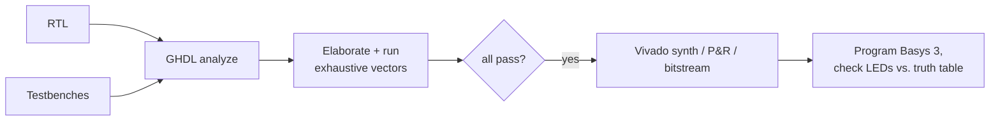

# Verification

Both designs are verified at two independent levels:

1. **Exhaustive self-checking simulation** — every possible input combination
   is driven and every output bit is checked against a behavioral model.
2. **On-board validation** — each bitstream was programmed onto a physical
   Basys 3 and the LED behavior compared against the truth tables.



## Simulation

### Strategy

The input spaces are small enough to enumerate completely, so the testbenches
do exactly that — no sampled or directed-only testing:

| Testbench | Stimulus | Vectors | Checks |
|---|---|---:|---|
| `tb_decoder_2to4` | All 4 values of `A` | 4 | Selected output low, all others high (one-cold) |
| `tb_decoder_bcd` | All 32 combinations of `EN` × `B` | 32 | One-hot on `Y(B)` for valid digits; all-zero for `EN = 0` and for invalid codes 10–15 |

Each testbench builds the expected output vector independently of the RTL,
compares the full output bus after every stimulus, reports any mismatch with
the offending input value, and terminates with a non-zero exit code on failure
(`severity failure`) so the scripts and CI fail loudly.

### Running

```sh
./scripts/run_tests.sh            # analyze + run everything
WAVES=1 ./scripts/run_tests.sh    # additionally dump build/sim/*.ghw for GTKWave
```

Output from a real run (GHDL, macOS):

```
==> tb_decoder_2to4
tb/tb_decoder_2to4.vhd:44:13:@40ns:(report note): tb_decoder_2to4: PASS (4/4 vectors)
==> tb_decoder_bcd
tb/tb_decoder_bcd.vhd:59:13:@320ns:(report note): tb_decoder_bcd: PASS (32/32 vectors)
All testbenches passed.
```

CI ([`.github/workflows/sim.yml`](../.github/workflows/sim.yml)) repeats this
run on every push and pull request.

## Hardware validation

Each design was synthesized, placed and routed with Vivado (2017.4), and the
bitstream programmed onto a Basys 3 over USB-JTAG. Inputs were applied with the
slide switches and outputs read from LEDs `LD0–LD9`.

A note on polarity: the Basys 3 LEDs are active-high. For `decoder_2to4`, whose
outputs are active-low, the selected output is therefore the one LED that is
**off** — the board itself makes the polarity difference visible.

### `decoder_2to4` — observed results (all 4 combinations)

| A1 | A0 | X3 X2 X1 X0 observed | LED indication |
|:--:|:--:|:--:|---|
| 0 | 0 | `1110` | LD0 off, others on |
| 0 | 1 | `1101` | LD1 off, others on |
| 1 | 0 | `1011` | LD2 off, others on |
| 1 | 1 | `0111` | LD3 off, others on |

### `decoder_bcd` — observed results

All 16 input codes with `EN = 1`, plus the disabled case, were applied on the
board and matched the truth table:

| EN | B3 B2 B1 B0 | Decimal | Observed output |
|:--:|:--:|:--:|---|
| 1 | `0000` | 0 | `Y0 = 1` (LD0 on, only) |
| 1 | `0001` | 1 | `Y1 = 1` |
| 1 | `0010` | 2 | `Y2 = 1` |
| 1 | `0011` | 3 | `Y3 = 1` |
| 1 | `0100` | 4 | `Y4 = 1` |
| 1 | `0101` | 5 | `Y5 = 1` |
| 1 | `0110` | 6 | `Y6 = 1` |
| 1 | `0111` | 7 | `Y7 = 1` |
| 1 | `1000` | 8 | `Y8 = 1` |
| 1 | `1001` | 9 | `Y9 = 1` (LD9 on, only) |
| 1 | `1010`–`1111` | invalid | all outputs 0, all LEDs off |
| 0 | `XXXX` | — | all outputs 0, all LEDs off |

## Reproducing the hardware build

```sh
vivado -mode batch -source scripts/build_bitstream.tcl -tclargs decoder_2to4
vivado -mode batch -source scripts/build_bitstream.tcl -tclargs decoder_bcd
```

The script runs a non-project batch flow (`read_vhdl` → `synth_design` →
`opt_design` → `place_design` → `route_design` → `write_bitstream`) and writes
the bitstream plus utilization and timing reports to `build/vivado/`. Program
the resulting `.bit` from Vivado Hardware Manager.
